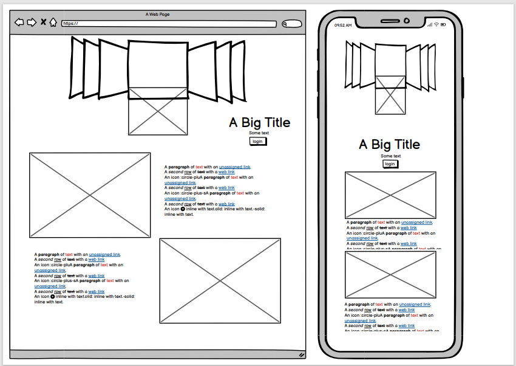

# 🎨 Hidden Brush

Hidden Brush is a collaborative art gallery web application where users can view, like, and comment on artwork. This project is built using Django, Python, JavaScript, HTML, and CSS, and it demonstrates various features including user authentication, comment management, and interactive galleries.

## 📖 Table of Contents

- [Project Overview](#project-overview)
- [Wireframe](#wireframe)
- [Features](#features)
- [Technology Stack](#technology-stack)
- [Installation](#installation)
- [Usage](#usage)
- [Project Structure](#project-structure)
- [Contributing](#contributing)
- [Credit](#credit)
- [Contact](#contact)

## 🖼 Project Overview

Hidden Brush allows users to explore various artworks, interact with them by liking and commenting, and manage their comments. The application supports user authentication, ensuring that only registered users can engage with the content. The project is divided into several apps for modular development and easy maintenance.

## 📝 Wireframe

The wireframe below outlines the basic structure of the Hidden Brush application:

### Landing/Home page

### Login Page
- **Login/Register Page**: Allows users to log in or create a new account.

### Gallery Page
- **Home Page/Gallery Page**: Displays a collection of artworks in a grid format. Each artwork has a like button and a comment section.

### Comment Page
- **Login/Register Page**: Allows users to log in or create a new account.

## ✨Features

- **User Authentication:** Secure login and registration for users.
 ### Login Page and Registration Form
 
 
- **Gallery Display:** View a collection of artworks in a gallery format.
 ### Gallery Page
 
- **Like and Comment:** Users can like artworks and leave comments.
 ### Like and Comment Section
 
- **Comment Management:** Users can add, view, edit, and delete their comments.
 ### Comment Page
 
- **Responsive Design:** The application is accessible on desktop ,mobile  Tablet and Laptop devices.
 ### Responsive in all Devices
 

 ## 🛠 Technology Stack

| Technology | Description |
|------------|-------------|
| **Django** | Web framework used for developing the backend and managing the database. |
| **Python** | Programming language used for the backend logic. |
| **JavaScript** | For dynamic front-end interactions. |
| **HTML5 & CSS3** | Markup and styling for the frontend. |
| **SQLite** | Default database for development. |
| **Git** | Version control system used for code management. |

## 🚀Installation

### Prerequisites

- Python 3.12
- Django
- Git

### Install Dependencies
- pip install -r requirements.txt

### Run Migrations

- python manage.py makemigrations
- python manage.py migrate

### Create a Superuser
- python manage.py createsuperuser

### Run the Development Server
- python manage.py runserver

- Access the application (our browser url)

## 💻 Usage
### User Interaction
- Registration: New users can register by providing a username, email, and password.
- Login: Registered users can log in to access all features.
- Browse Gallery: Users can view artwork in the gallery.
- Like Artworks: Logged-in users can like their favorite pieces.
- Comment on Artworks: Logged-in users can add, edit, and delete comments on artworks.

## 🤝 Contributing
- Contributions are welcome! Please follow these steps to contribute:

- Fork the repository.
- Create a new branch (git checkout -b feature/YourFeature).
- Commit your changes (git commit -m 'Add YourFeature').
- Push to the branch (git push origin feature/YourFeature).
- Open a Pull Request.

- Please ensure your code follows the project’s style guidelines and passes all tests.

## 📬 Contact
- For any inquiries or issues, please contact:

-Project Maintainer: Admin
-Email: admin@email.com

